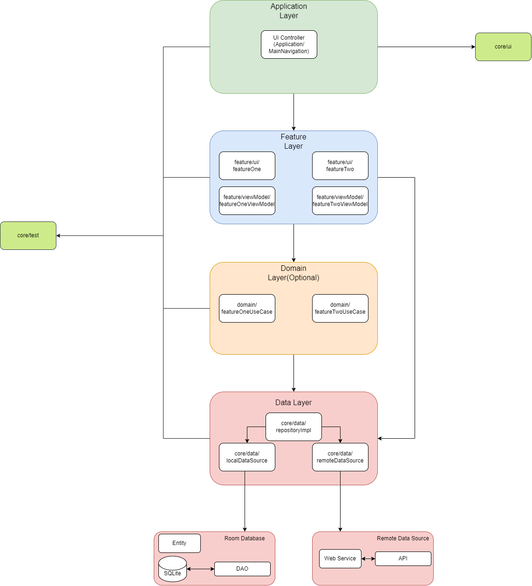
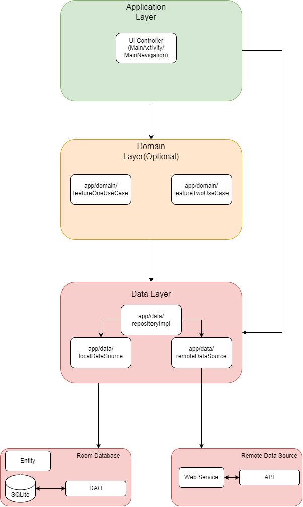

Y—Template
==================
Y—Template aims to build your initial setup for your Android project quickly. The project provides you organised structures following MVVM architecture and also provides dependencies to support major functionalities which an Android project needs

The project includes a shell script file `YTemplate.sh` which renames and restructures the Android project based on the package name, model name and application name the Android project needs.

### How to run the Y—Template script
- The script file `YTemplate.sh` takes two inputs.
  - `<package_name>` is your app ID and should be in lower-case.
  - `<application_name>` Optional input.
  - `./YTemplate.sh <package_name> <application_name>`.

Note: To run the shell script on Windows, one can run bash on ubuntu in Windows(starting from Windows 10) or GitWindows(https://git-scm.com/download/win).
Type ` bash YTemplate.sh <package_name> <application_name>`. It will execute the script.


## Features
* Compose UI.
* HILT dependency for dependency injection.
* Jetpack navigation.
* Version catalog support for handling dependencies.
* MVVM architecture.
* Room database support for Local database.
* Ktor for remote database connection.
* Jacoco support for test report generation.


### Architecture
Y—Template follows MVVM architecture. Different modules support different layers of MVVM architecture.

##### Multi-Module
* `app` : Entry point for the app. Provides basic structures such as Application classes, Navigation components.
* `feature` : Module where different features can be added with the respective fragment/activity classes and view-models.
* `core/domain`(optional) : Module to add the domain/use case layers for different features which can be shared across multiple features.
* `core/data` : Module to handle the data layer of the app. This layer supports both local database and remote database.
* `build-logic` : Module where the dependencies are added for the Android project and contains build configuration logics for gradle tasks.



##### Single-Module
* `app` : Module to add various features to the app and providing basic structures such as Application classes, Navigation components. This is a combined version of app and feature module of Multi-module architecture.
* `domain`(optional) : Package structure that can be added under app module which would contain domain/use case files. This is similar to core/domain in multi-module
* `data` : Package structure to handle the data layer placed under the app module. This is similar to core/data in multi-module
* `buildSrc` : Module containing complex build logic encapsulated as a custom task.



### How to generate test report
- Generating jacoco debug test report
  - Gradle command `clean build createMergedJacocoReport`
    - From Android Studio
      - Open gradle menu bar from Android Studio right side panel
      - Click on the gradle icon and
      - In command popup window type `clean build createMergedJacocoReport` and press enter
      - Wait for the execution completion,
      - After successful execution report will be stored in 'project\build\reports\jacoco\html\index.html'.

### How to generate dokka report
- Gradle command single module `clean build dokkaHtml` for multi-module `clean build dokkaHtmlMultiModule`
  - From Android Studio
  - Open gradle menu bar from Android Studio right-side panel
  - Click on the gradle icon and
  - In the command popup window type `dokkaHtml` for multi-module `dokkaHtmlMultiModule`

### How to check Ktlint
- Gradle command for checking lint error `ktlintCheck`
- Gradle command for formatting code `ktlintFormat`


## License

```
    Copyright 2023 Y—Template

    Licensed under the Apache License, Version 2.0 (the "License");
    you may not use this file except in compliance with the License.
    You may obtain a copy of the License at

        http://www.apache.org/licenses/LICENSE-2.0

    Unless required by applicable law or agreed to in writing, software
    distributed under the License is distributed on an "AS IS" BASIS,
    WITHOUT WARRANTIES OR CONDITIONS OF ANY KIND, either express or implied.
    See the License for the specific language governing permissions and
    limitations under the License.
```

